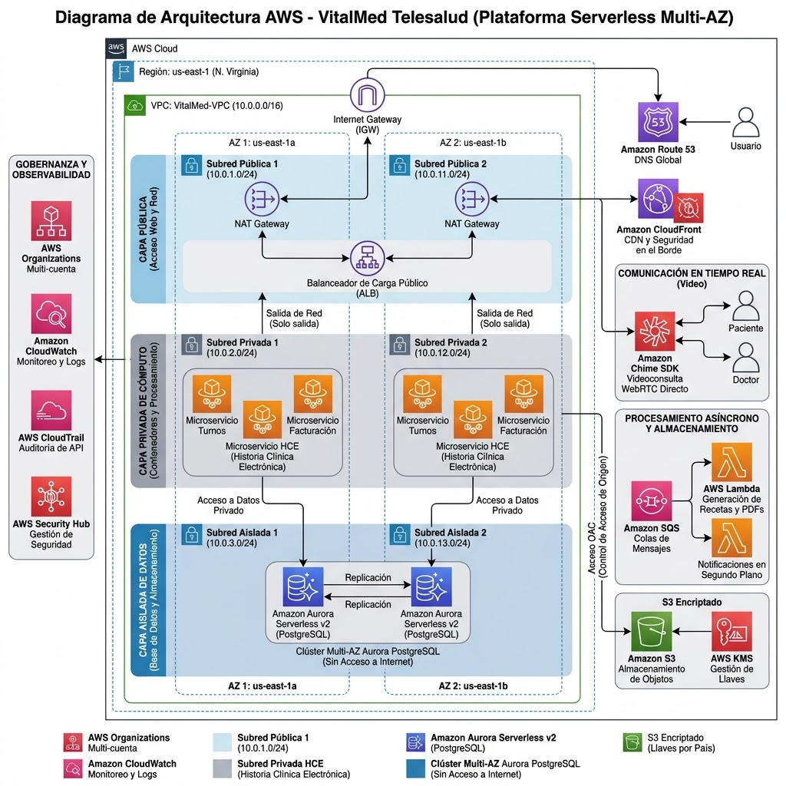
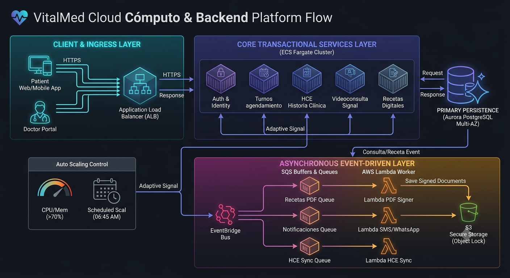
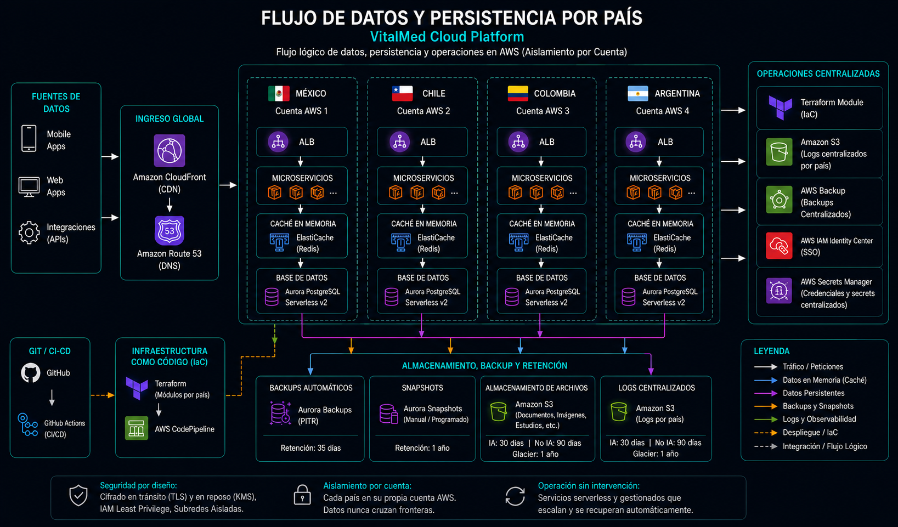
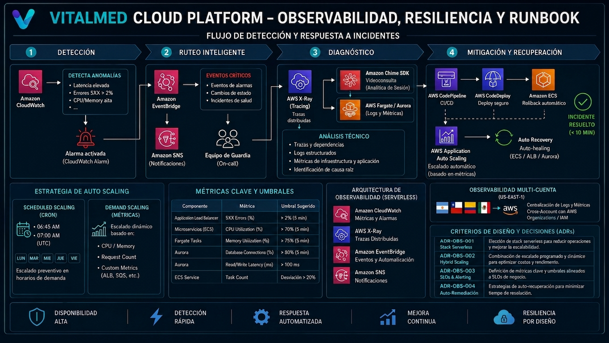
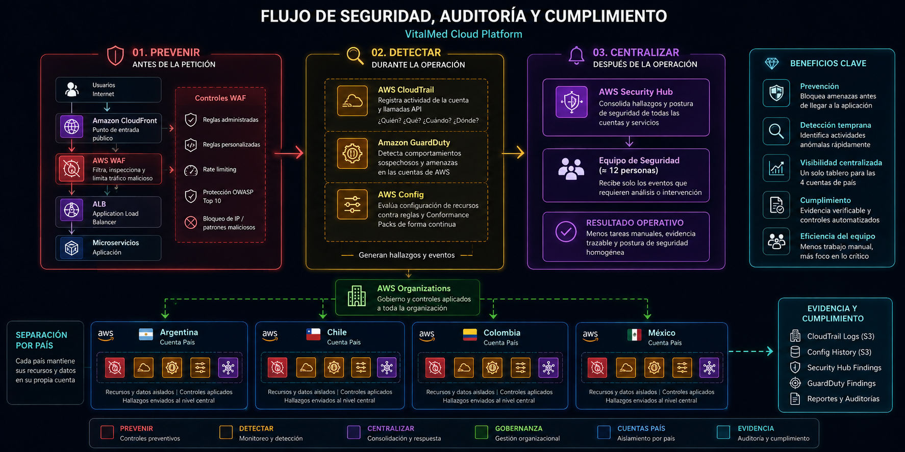

# VitalMed Telesalud — Informe Consolidado de Arquitectura AWS

**Grupo 9 · Diplomatura DevOps · Pilar: Excelencia Operativa**

### Integrantes

* **Josias Ñañez**
* **Lautaro Castro**
* **Jeronimo Massaro**
* **Maximiliano Cravero**
* **Gabriel**

---

## 1. Caso de Negocio y Contexto

VitalMed conecta a más de **180.000 pacientes** con una red de **4.500 profesionales** en Argentina, Chile, Colombia y México, ofreciendo videoconsultas, recetas digitales, resultados de laboratorio e historia clínica electrónica (HCE) compartida. Todo esto lo sostiene un equipo de tecnología de apenas **12 personas** para los cuatro países, bajo el pilar de **Excelencia Operativa** del AWS Well-Architected Framework.

| Indicador | Valor |
|---|---|
| Pico estacional | hasta x4 consultas (otoño/invierno + campañas de vacunación) |
| Ventana crítica de atención | 07:00 – 23:00 hs |
| Equipo técnico | 12 personas / 4 países |

**El problema:** un esquema de capacidad fija obligaría a sobredimensionar todo el año para un pico que dura pocas semanas; no hacerlo arriesga caídas durante una consulta médica en curso.

**El objetivo de negocio:** sostener el crecimiento a 4 países —y poder incorporar un quinto— sin caídas en horario de atención, sin escalar la plantilla al ritmo de la demanda, y cumpliendo con la separación de datos de salud que exige cada país.

**La solución, servicio por servicio:**
- **Cómputo:** ECS Fargate + Auto Scaling (reactivo + programado antes de las 07:00).
- **Asincronismo:** EventBridge + SQS amortiguan facturación, PDFs y sincronización de HCE.
- **Datos:** Aurora Serverless v2 escala la capacidad de BD según demanda real.
- **Observabilidad:** CloudWatch + alertas proactivas antes de que un paciente pierda una videoconsulta.

---

## 2. IAM, Organización y Gobierno de Accesos

### 2.1 Estructura de AWS Organizations

Landing zone provisionada con **AWS Control Tower** (el alta de un 5º país se resuelve desde el Account Factory con guardrails ya aplicados). Root: `r-vitalmed`.

**Core OU** (`ou-core-01`) — servicios compartidos:
- **Log Archive Account:** almacenamiento inmutable WORM de logs de CloudTrail, VPC Flow Logs y GuardDuty.
- **Security Account (SecOps):** SecurityHub, GuardDuty, IAM Access Analyzer; AWS Config como administrador delegado audita compliance en las 4 cuentas de país sin revisión manual.
- **Shared Services Account:** repositorio ECR, artefactos CI/CD y DNS central.

**Workloads OU** (`ou-workloads-02`) — un ambiente de aplicación por país:
- 🇦🇷 Argentina, 🇨🇱 Chile, 🇨🇴 Colombia, 🇲🇽 México — cada una con su propio clúster ECS Fargate + Aurora PostgreSQL.

### 2.2 Usuarios y SSO (AWS IAM Identity Center)

RBAC para los 12 integrantes del equipo técnico, con **MFA obligatorio**:

| Grupo SSO | Miembros | Permission Set | Alcance |
|---|---|---|---|
| **DevOps-Admins** | 2 | AdministratorAccess (Shared Services + Non-Prod); en Prod solo break-glass temporal (≤1h, con justificación) | Root, Core OU, Workloads OU (elevación temporal). Cambios en cuentas-país se aplican por el pipeline de Terraform, no por sesión humana |
| **Developers** | — | AppDeveloper (custom, acotado, sin IAM/SCP/Org) | Cuenta(s)-país asignada(s) individualmente (no las 4 por defecto); Shared Services solo lectura (ECR) |
| **Auditors/Security** | 2 | SecurityAudit + ReadOnlyAccess | Log Archive Account y Security Account. Solo lectura, sin modificar datos de salud ni configuraciones |

### 2.3 Roles IAM (identidades de servicio, sin claves estáticas)

| Rol | Tipo | Permisos | Mecanismo de confianza |
|---|---|---|---|
| **GitHubActions-CI-Role** | OIDC Identity Provider | `ecr:PutImage`, `ecr:BatchCheckLayerAvailability` sobre Shared Services | Token JWT temporal de GitHub (1h), sin AWS Access Keys en el repo |
| **ECS-ExecutionRole** | AWS Service Trust | `AmazonECSTaskExecutionRolePolicy` (pull de imagen, logs) | `ecs-tasks.amazonaws.com` |
| **ECS-AppTaskRole** | Identidad de aplicación | `secretsmanager:GetSecretValue`, `rds-db:connect` sobre la Aurora DB local del país | Fargate Container Credentials Provider |

### 2.4 Decisiones de Arquitectura (ADRs de IAM)

- **ADR-001 (Aprobado) — Multi-cuenta por país vs. multi-tenant monolítico:** cada país en una cuenta AWS independiente bajo `Workloads`, sin conectividad cruzada. Beneficio: un compromiso en una cuenta nunca afecta a los demás países.
- **ADR-002 (Aprobado) — SSO y cero claves estáticas:** SCP a nivel Root prohíbe usuarios IAM con Access Key/Secret Key. Autenticación federada con MFA y credenciales temporales (máx. 1–8h).
- **ADR-003 (Aprobado) — OIDC para CI/CD:** GitHub Actions solicita tokens de corta duración; si el repo es vulnerado no hay secretos de AWS que extraer.
- **ADR-004 (Aprobado) — ExecutionRole vs. TaskRole separados:** el runtime del contenedor y el código de negocio tienen permisos distintos y mínimos.
- **ADR-005 (Supuesto explícito) — Mono-región (us-east-1) vs. multirregión por país:** AWS no tiene región propia en Argentina, Chile ni Colombia (la más cercana es sa-east-1); México sí tiene región propia desde 2025 (mx-central-1). Se optó por una sola región, resolviendo la separación regulatoria vía aislamiento lógico por cuenta (Organizations + SCP + KMS por cuenta) en lugar de aislamiento geográfico. **Trade-off aceptado:** un incidente regional de AWS en us-east-1 afectaría a los 4 países simultáneamente; se acepta el riesgo por simplicidad operativa dado el tamaño del equipo.

**Flujo operativo de acceso:** Identificación (portal SSO / token OIDC) → Evaluación de SCP (región válida, acciones prohibidas) → Asunción PoLP (Permission Set/Role del perfil) → Auditoría WORM (toda llamada API queda en CloudTrail, cuenta Log Archive).

---

## 3. Redes y Arquitectura VPC

### 3.1 Topología de 3 capas (Multi-AZ, aislada por cuenta-país)

Cada país tiene su propia VPC (ej. VPC-Argentina `10.0.0.0/16`) distribuida en 2 AZs (`us-east-1a`/`us-east-1b`):

| Capa | Contenido | Rango (ejemplo) |
|---|---|---|
| **1. Pública** | ALB expuesto + NAT Gateways redundantes (ruta a IGW) | AZ-a `10.0.1.0/24`, AZ-b `10.0.11.0/24` |
| **2. Privada** | Tareas ECS Fargate (Turnos, HCE, Facturación); sin tráfico directo de internet | AZ-a `10.0.2.0/24`, AZ-b `10.0.12.0/24` |
| **3. Aislada** | Bases de datos y caché; sin ruta a NAT/IGW bajo ninguna circunstancia | AZ-a `10.0.3.0/24`, AZ-b `10.0.13.0/24` |

### 3.2 Ruteo y VPC Endpoints

- **NAT Gateways (Multi-AZ):** en subredes públicas, permiten llamadas salientes de ECS a APIs de terceros (pasarelas de pago, aseguradoras) sin exponer conexiones entrantes.
- **VPC Endpoints (Privatelink):** Gateway Endpoint para S3; Interface Endpoints para ECR, Secrets Manager y CloudWatch Logs — evitan que ese tráfico consuma NAT/internet.
- **Enrutamiento multi-país bajo un único dominio:**
  1. **Geo-Location Routing:** Route 53 resuelve según la IP del paciente/médico.
  2. **Ruteo por path de URL:** CloudFront/ALB derivan `/ar/api/...`, `/cl/api/...`, etc.
  3. **Aislamiento backend:** cada petición termina en la VPC aislada del país correspondiente.

**Flujo de tránsito de red:** Route 53 + CloudFront/WAF (Edge) → ALB en subred pública → ECS Fargate en subred privada → Aurora en subred aislada.

### 3.3 Decisiones de Arquitectura (ADRs de Red)

- **ADR-NET-001 (Aprobado):** topología de 3 capas — imposibilidad matemática de acceso directo desde internet a la BD.
- **ADR-NET-002 (Aprobado):** VPC Endpoints vs. tráfico por NAT — reduce costos de procesamiento de datos y mantiene el tráfico dentro del backbone de AWS.
- **ADR-NET-003 (Aprobado):** tráfico multimedia (Amazon Chime SDK) fuera de la VPC — las videoconsultas van cliente-servidor directo, sin pasar por contenedores ni VPC, reduciendo latencia y costo.
- **ADR-NET-004 (Aprobado):** sin Peering/Transit Gateway entre VPCs de país — evita movimientos laterales y garantiza soberanía de datos. El aislamiento es **doble**: red (VPC independiente) + cuenta (AWS Organizations, con su propia Aurora, KMS e IAM).
- **ADR-NET-005 (Supuesto explícito):** despliegue mono-región (us-east-1) con redes separadas por CIDR independiente por cuenta-país. Mismo trade-off que ADR-005 de IAM.

---

## 4. Cómputo y Backend

### 4.1 Catálogo de microservicios en ECS Fargate

| Microservicio | Tipo | Stack / Infra |
|---|---|---|
| Auth & Identity Service | Síncrono / Crítico | Node.js/Express · ECS (0.5 vCPU/1GB) |
| Turnos & Agendamiento | Síncrono / I/O intensivo | Python FastAPI · ECS (0.5 vCPU/1GB) |
| Historia Clínica (HCE) | Síncrono / Datos sensibles | Python FastAPI · ECS (1 vCPU/2GB) |
| Sala de Telemedicina | Síncrono / señalización WebRTC | Node.js (WebSockets) · ECS (1 vCPU/2GB); al finalizar emite evento a EventBridge |
| **Videoconsulta en Vivo (Media)** | Amazon Chime SDK — fuera de ECS/VPC | Provee el video/audio real; desacopla el costo de CPU/ancho de banda del resto de la plataforma |
| Prescripciones Médicas | Síncrono / Validación | Python FastAPI · Lambda (delega firma/PDF al flujo asíncrono) |
| Centro de Notificaciones | Híbrido / Event-driven | Node.js · Lambda/SQS Worker |

### 4.2 Auto-escalado y prevención de Cold Start

- **Escalado reactivo por métricas mixtas (Target Tracking):**
  1. `ALB Request Count Per Target` — escala ante picos HTTP entrantes.
  2. `ECSServiceAverageCPUUtilization` — escala si CPU > 70% promedio.
- **Scheduled Scaling (prevención de Cold Start):**
  - Apertura clínica diaria (06:45 AM): eleva el *Desired Count* mínimo a 4–6 tareas antes de las 07:00.
  - Picos estacionales (x4): reajuste del mínimo garantizado vía Terraform durante meses de alta demanda.

### 4.3 Arquitectura asíncrona orientada a eventos

Flujo al finalizar una consulta: **Microservicio ECS** emite evento JSON a **EventBridge** → enruta en paralelo a **SQS** (amortigua picos) → **Lambdas** procesan PDF de receta, sincronizan HCE y envían facturas, sin saturar los ECS principales.

### 4.4 Despliegue y rollback

- **Rolling Update nativo de ECS Fargate** (no Blue/Green, para no duplicar capacidad):
  - `Minimum Healthy Percent = 100%` (capacidad intacta durante el despliegue).
  - `Maximum Percent = 200%` (tareas nuevas en paralelo, se retiran las viejas al pasar health checks).
- **Deployment Circuit Breaker:** si el código nuevo falla los ALB Health Checks, ECS cancela el despliegue y hace rollback automático a la última versión estable, sin intervención humana.

### 4.5 Decisiones de Arquitectura (ADRs de Cómputo)

- **ADR-COMP-001 (Aprobado):** Fargate Serverless vs. EKS/EC2 — elimina gestión de servidores/parches/clústeres K8s para un equipo de 12 personas.
- **ADR-COMP-002 (Aprobado):** auto-escalado reactivo mixto + programado — evita saturación y cold starts.
- **ADR-COMP-003 (Aprobado):** Rolling Update con Circuit Breaker vs. Blue/Green — rollback automático sin duplicar costos ni requerir CodeDeploy.
- **ADR-COMP-004 (Aprobado):** desacoplamiento asíncrono con EventBridge + SQS + Lambda — resiliencia ante caídas de APIs de terceros (obras sociales).
- **ADR-COMP-005 (Aprobado):** media de videoconsulta fuera de la VPC (Chime SDK) — un pico de videoconsultas no compite por CPU/memoria con el resto de microservicios.

---

## 5. Persistencia y Datos

### 5.1 Amazon Aurora Serverless v2 (Multi-AZ) — motor relacional principal

Almacena HCE y registros de consultas, agendas/turnos, perfiles y transacciones de facturación/liquidación con aseguradoras.

- **Consistencia ACID** para registros médicos y financieros.
- **Escalabilidad elástica automática** (ACUs) ante picos de invierno o vacunación (hasta x4), contrayéndose de noche.
- **Alta disponibilidad Multi-AZ** con failover automático en < 30 segundos (SLA de cero caídas en horario 7–23h).
- **RDS Proxy** para pooling eficiente de conexiones concurrentes desde ECS y Lambda.
- Soporte nativo **JSONB** (flexibilidad de datos clínicos); cifrado en reposo con **KMS (CMK propia por cuenta/país)** y en tránsito (TLS).
- **Secrets Manager:** credenciales rotadas automáticamente, nunca hardcodeadas.
- Ubicación: **subred aislada** (capa 3 de la VPC), sin ruta a IGW ni NAT.

### 5.2 Amazon ElastiCache (Redis Serverless) — caché in-memory

Desplegado en la subred privada/aislada, latencia < 10 ms:

- **Sesiones médicas:** tokens JWT de los 180.000 pacientes y 4.500 profesionales, validación submilisegundo.
- **Read-heavy caching:** catálogos de cobertura médica, disponibilidad de especialistas — reduce latencia de >500 ms a <10 ms.
- **Bloqueos distribuidos:** evita colisiones cuando múltiples pacientes reservan el mismo turno en simultáneo.
- Alta disponibilidad: clúster con réplica en otra AZ y failover automático.
- Modalidad **Serverless**: cero planificación de capacidad ni parches de SO para el equipo de 12 personas.

### 5.3 Amazon S3 — almacenamiento de objetos

- Grabaciones de videoconsultas (autorizadas), recetas digitales firmadas (PDFs vía Lambda), resultados de laboratorio/estudios.
- Desacopla la BD relacional de datos binarios pesados (BLOBs).
- **Lifecycle Rules:** transición automática a S3 Glacier Instant Retrieval / Deep Archive tras el período activo, cumpliendo retención clínica legal (10 años).
- **Object Lock (WORM):** inmutabilidad legal — ningún historial clínico puede borrarse/alterarse antes del plazo reglamentario.
- URLs prefirmadas para acceso temporal seguro médico-paciente.

### 5.4 AWS Backup — respaldo centralizado

En lugar de backups nativos aislados por servicio (Aurora, S3, EBS):

- **Punto único de control y gobernanza** de toda la estrategia de backup.
- **Cross-Account & Cross-Region Backup** hacia cuenta de auditoría/región secundaria (protección ante borrado accidental, corrupción o ransomware).
- **Backup Vault Lock:** directivas inmutables — ni siquiera un admin root puede modificar/eliminar copias de HCE antes del plazo legal.
- Reduce sobrecarga operativa: retención, transición a archivo y auditoría automatizadas para el equipo de 12 personas.

### 5.5 Otros componentes de la capa de datos

- **Amazon ECR + Git/Terraform:** código e IaC en repos Git externos; ECR solo como registry de imágenes Docker, con escaneo automático de vulnerabilidades al hacer push.

### 5.6 Decisiones de Arquitectura (ADRs de Persistencia)

- **ADR-NET-004 (Aprobado):** soberanía de datos — aislamiento doble (VPC + cuenta AWS separada por país, con su propia Aurora, KMS e IAM).
- **ADR-DB-001 (Aprobado):** Aurora Serverless v2 + ElastiCache Serverless para minimizar carga operativa (sin parcheo, reescalado manual ni administración de shards).
- **ADR-DB-002 (Aprobado):** PostgreSQL sobre MySQL — soporte JSONB para HCE evolutivas, manteniendo rigidez ACID en facturación.
- **ADR-STO-001 (Aprobado):** S3 Lifecycle Policies nativas en vez de crons/Lambdas custom — retención de 10 años al menor costo, 0% código a mantener.
- **ADR-STO-002 (Aprobado):** AWS Backup centralizado en vez de snapshots nativos aislados por servicio.
- **ADR-SEC-001 (Aprobado):** Secrets Manager (rotación automática) + KMS con CMK propia por cuenta/país — ninguna credencial hardcodeada, aislamiento regulatorio también a nivel criptográfico.

---

## 6. Observabilidad, Alertas y Scaling

### 6.1 Stack de telemetría serverless

- **CloudWatch & Container Insights:** logs centralizados de ECS Fargate y métricas de CPU/memoria/red por microservicio.
- **AWS X-Ray:** traza el recorrido completo de cada videoconsulta/consulta de HCE a través de microservicios y Aurora, aislando cuellos de botella.
- **EventBridge + Amazon SNS:** filtra eventos críticos de CloudWatch y notifica al equipo sin ruido ni falsos positivos.

### 6.2 Métricas clave y umbrales de alerta

| Componente | Métrica | Umbral | Objetivo |
|---|---|---|---|
| Videoconsultas (ALB) | TargetResponseTime | > 1.5s (2 min) | Prevenir degradación de audio/video antes de que caiga la llamada |
| Microservicio HCE | HTTPCode_Target_5XX_Count | > 2% de peticiones | Detectar fallos en consulta de HCE |
| Fargate Clusters | CPU/MemoryUtilization | > 70% asignado | Iniciar auto-escalado antes de saturar el contenedor |
| Base de Datos Aurora | DatabaseConnections/CPU | > 80% límite | Evitar bloqueos de lectura/escritura en registros médicos |

### 6.3 Decisiones de Arquitectura (ADRs de Observabilidad)

- **ADR-OBS-001 (Aprobado):** stack nativo serverless (CloudWatch + X-Ray) vs. herramientas mantenidas — cero gestión de agentes o bases de logs propias.
- **ADR-OBS-003 (Aprobado):** filtros de eventos en EventBridge para evitar fatiga por alertas — cada notificación requiere acción inmediata, MTTR < 10 min.
- **ADR-OBS-004 (Aprobado):** trazabilidad end-to-end con X-Ray propagando headers en todas las llamadas internas y consultas a Aurora.
- **ADR-OBS-005 (Supuesto explícito):** centralización mono-región de logs en us-east-1 vía CloudWatch Cross-Account Observability — visibilidad unificada para el equipo, con dependencia de conectividad interna a us-east-1.

---

## 7. Seguridad, Auditoría y Cumplimiento

### 7.1 Flujo de seguridad: Prevenir → Detectar → Centralizar

**01. PREVENIR (antes):** CloudFront (entrada pública) → **AWS WAF** (reglas administradas, rate limiting, bloqueo de patrones maliciosos, configurado en Terraform) → ALB → Microservicios.

**02. DETECTAR (durante):**
- **AWS CloudTrail:** evidencia de quién ejecutó qué acción, con qué servicio y cuándo (management + data events).
- **Amazon GuardDuty:** detección administrada de actividad anómala, gestionada desde un administrador delegado de Organizations, con auto-enable para cuentas nuevas.
- **AWS Config + Conformance Packs:** reglas de compliance versionadas como YAML, aplicadas homogéneamente a las 4 cuentas-país, con historial de drift.

**03. CENTRALIZAR (después):** **AWS Security Hub** consolida findings de las 4 cuentas en un solo tablero (administrador delegado); el equipo de 12 personas recibe solo eventos que requieren intervención, no una revisión manual cuenta por cuenta.

> Nota importante: la auditoría de infraestructura (CloudTrail) **no resuelve** por sí sola la trazabilidad funcional de "qué profesional vio qué HCE" — cada microservicio que expone datos clínicos debe generar su propia auditoría de acceso persistida en S3, con retención según normativa de cada país (ver ADR-AUD-002).

### 7.2 Gobierno automatizado con Terraform

Principio operativo: *"El equipo no debería descubrir manualmente que una cuenta quedó insegura."*

- **Código como fuente de verdad:** WAF, CloudTrail, Config, GuardDuty y Security Hub modelados en Terraform cuando son administrables como IaC; cambios vía Git + peer review.
- **Mismo control en 4 cuentas:** módulos parametrizados por país, sin copiar configuraciones a mano.
- **Evidencia auditable:** Git conserva quién cambió infraestructura; AWS conserva evidencia de actividad y compliance — fuentes separadas.
- **Modelo operativo:** Developer propone cambio → Git + Review (peer review) → Terraform aplica IaC → AWS Config comprueba el estado real vs. reglas esperadas → Security Hub consolida hallazgos → CloudTrail conserva evidencia.

### 7.3 Decisiones de Arquitectura (ADRs de Seguridad/Auditoría/Compliance)

- **ADR-SEC-001 (Aprobado):** WAF en el borde con CloudFront — filtra tráfico no deseado antes del ALB.
- **ADR-AUD-001 (Aprobado):** CloudTrail como evidencia central de actividad AWS.
- **ADR-CMP-001 (Aprobado):** compliance como código con AWS Config y Conformance Packs.
- **ADR-SEC-002 (Aprobado):** GuardDuty administrado desde cuenta delegada — evita 4 configuraciones independientes.
- **ADR-SEC-003 (Aprobado):** Security Hub como punto central de postura de seguridad, sin eliminar el aislamiento de cuentas por país.
- **ADR-IAC-001 (Aprobado):** seguridad reproducible mediante Terraform, módulos reutilizables por país, cambios sujetos a Git/peer review.
- **ADR-AUD-002 (Supuesto / Validar):** auditoría de acceso a la HCE a nivel de aplicación — cada microservicio debe registrar su propia auditoría funcional en S3, complementando a CloudTrail.

---

## 8. Estimación de Costos de Infraestructura AWS

Basado en AWS Pricing Calculator, para operación multipaís (🇦🇷 🇨🇱 🇨🇴 🇲🇽).

### 8.1 Estimación base (1 cuenta/país) — $1.409,02 USD/mes

| Grupo de Uso | Servicios | Costo mensual (USD) |
|---|---|---|
| Datos | Aurora Serverless v2, ElastiCache Redis, S3, Backup, Data Transfer | $724,11 |
| Media | Amazon Chime SDK | $272,00 |
| Cómputo | ECS Fargate, Lambda (ARM), Data Transfer Out | $226,15 |
| Observabilidad | CloudWatch, GuardDuty, Config, Security Hub, X-Ray, CloudTrail, SNS | $137,35 |
| Red | WAF, CloudFront, Route 53 | $42,10 |
| Organización | KMS, Secrets Manager | $6,25 |
| Integración Asincrónica | SQS | $1,05 |

### 8.2 Replicabilidad multipaís

- **Servicios replicados por país** (Datos + Cómputo + Integración Asincrónica): **$951,31/mes** por país.
- **Servicios transversales/globales** (Media, Observabilidad, Red, Organización): **$457,70/mes**, una sola vez.
- **Cuenta de preproducción** (stack completo compartido por todos los países): **$951,31/mes**.

### 8.3 Proyección total (4 países + preproducción)

| Componente | Cálculo | Total mensual (USD) |
|---|---|---|
| Infraestructura replicada (4 cuentas + preprod) | $951,31 × 5 | $4.756,55 |
| Servicios transversales/globales | $457,70 × 1 | $457,70 |
| **Total General Estimado** | | **$5.214,25** |

### 8.4 Escenario de mes estacional (x4 tráfico)

| Grupo de Uso | Costo mensual estacional (USD) |
|---|---|
| Datos | $1.020,33 |
| Media | $1.088,00 |
| Cómputo | $489,35 |
| Observabilidad | $317,87 |
| Red | $130,80 |
| Organización | $16,00 |
| Integración Asincrónica | $4,20 |
| **Total base con aumento estacional** | **$3.066,54** |

**Total General Estimado con aumento estacional: $7.608,19 USD/mes.**

### 8.5 Conclusiones de la estimación

- **Autoescalado dinámico:** ECS Fargate (ARM/Graviton) + Aurora Serverless v2 ajustan cómputo/memoria automáticamente (picos 7–23h, mínimo en horario no pico), reduciendo el costo mensual >40% frente a esquemas estáticos.
- **Aislamiento y Blast Radius:** duplicar entornos de datos/cómputo por país garantiza que un incidente o pico estacional local no degrade la operación de los demás.
- **Mantenibilidad:** infraestructura replicada gestionada con módulos unificados de Terraform y servicios serverless/administrados, sostenible para un equipo reducido.

---

## 9. Runbook de Despliegue — Resumen Operativo

### 9.1 Cuentas AWS requeridas (7 en total con Organizations)

| Cuenta | Propósito |
|---|---|
| Management | AWS Organizations, facturación central, control de acceso |
| shared | Bucket S3 del state de Terraform + logging centralizado de CloudTrail |
| ar-prod / cl-prod / co-prod / mx-prod | VitalMed por país (producción) |
| preprod | Entorno de preproducción **único y global** (sin distinción de país) |

> No hay cuentas separadas de Security ni de Network, ni preproducción por país: GuardDuty/Security Hub/CloudTrail central quedan como trabajo futuro (son "solo diseño", ver §9.5).

**Herramientas requeridas:** Terraform ≥ 1.10.0, AWS CLI ≥ 2.x, GitHub CLI ≥ 2.x, jq ≥ 1.6.

### 9.2 Configuración de variables

Estructura por entorno: `terraform/environments/{ar,cl,co,mx}/prod/` y `terraform/environments/preprod/`. Cada uno declara solo dos variables (`account_id`, `zona_route53_id`); `pais`/`entorno` van como literales en `main.tf`, y los valores por defecto de Aurora/ECS/SQS viven en los módulos.

### 9.3 Orden de despliegue

**Primera vez:** `terraform/global/state-backend` (bootstrap, una sola vez) → `terraform/org` (Organizations + account factory) → `terraform/environments/<pais>/prod` (uno por vez) → `terraform/environments/preprod` (global, una sola vez).

**Actualizaciones:** rama de feature desde `main` → PR con peer review → merge → el pipeline CI/CD despliega automáticamente.

### 9.4 Validaciones y rollback

- **Previas al despliegue:** formato (`terraform fmt -check -recursive`), sintaxis (`terraform validate` por entorno), tests (`terraform test` por módulo), seguridad (sin credenciales hardcodeadas, KMS habilitado, S3 cifrado), arquitectura (Aurora Serverless v2, ECS sobre Fargate sin EC2, subnets de datos aisladas).
- **Posteriores al despliegue:** existencia/estado de VPC, Aurora, ECS y CloudFront; health check del ALB (`/turnos/health`); ACLs de S3 sin acceso público.
- **Rollback manual:** revertir el código (`git revert`) → re-aplicar (`terraform plan` + `apply`) → si el state quedó corrupto, restaurar versión anterior desde el bucket S3 versionado (`terraform state push`). Restaurar solo el state **no** revierte la infraestructura.
- **Rollback automático (CI/CD):** el pipeline encadena `deploy-preprod` → `deploy-prod` (4 países), y producción **no se despliega** si preprod falla (`needs: [deploy-preprod]`).

### 9.5 Servicios "solo diseño" (requieren cuenta real o trabajo futuro)

No provisionados aún por el Terraform actual: **CloudTrail** (trail organizacional), **GuardDuty**, **X-Ray**, **Security Hub**. Las validaciones de CloudWatch sí aplican (log groups de ECS y Container Insights ya codeados en `modules/compute`).

### 9.6 Pruebas de Excelencia Operativa

- **Observabilidad:** logs de microservicios llegando a CloudWatch; alarmas activas.
- **Seguridad:** buckets S3 privados; cifrado KMS en Aurora; credenciales gestionadas en Secrets Manager.
- **Resiliencia:** simulación de fallo de AZ (nuevos despliegues forzados en ECS); reemplazo automático de tareas; failover automático de Aurora.
- **Auto Scaling:** carga alta simulada → escalado horizontal de ECS por CPU; escalado vertical de ACUs en Aurora.

### 9.7 Referencia — Anexo de Operaciones (`runbook-operaciones.md`)

El runbook principal remite a un anexo con el material operativo detallado:

| Tema | Contenido destacado |
|---|---|
| **Naming conventions** | Patrón `<pais>-<entorno>-<servicio>-<recurso>`; tabla completa de nombres reales por tipo de recurso (VPC, subnets, ALB, ECS, Aurora, S3, SQS, Lambda, KMS, Secrets, Log Groups) |
| **Tagging** | Tags aplicados hoy: `Proyecto`, `Pais`, `Entorno`, `Tier`, `Servicio` (vía `default_tags` del provider); tags propuestos a futuro: `ManagedBy`, `Owner`, `Criticality`, `Backup` |
| **Monitoreo** | Tabla de métricas/umbrales/acciones para ECS, Aurora, ALB, S3, SQS y Lambda; ejemplos de `aws_cloudwatch_metric_alarm` en Terraform (nota: las alarmas y el dashboard SNS son material de referencia, no están codeados aún salvo log groups/Container Insights) |
| **Troubleshooting** | Tablas de errores comunes de Terraform y AWS con causa/solución; comandos de diagnóstico de conectividad a Aurora y ECS |
| **Colaboración** | Flujo Git trunk-based (todo sale y vuelve a `main` vía PR); convención de commits tipo Conventional Commits; checklist de code review |
| **Onboarding** | Prerrequisitos, primeros pasos (clonar repo, configurar AWS CLI, validar Terraform, correr tests con MiniStack), plan de mentoría de 4 semanas |
| **Contactos** | Tech Lead, DevOps, Security, On-Call (contactos genéricos por rol) |

---
